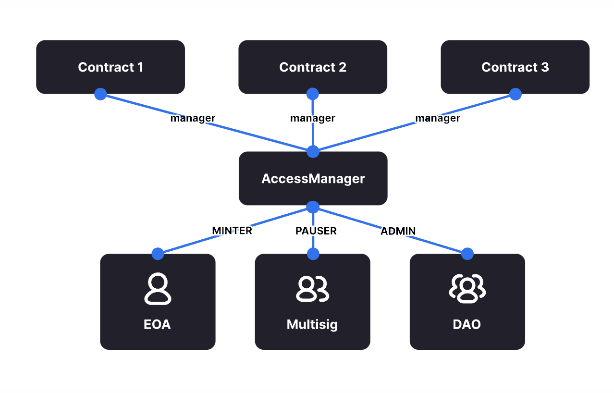
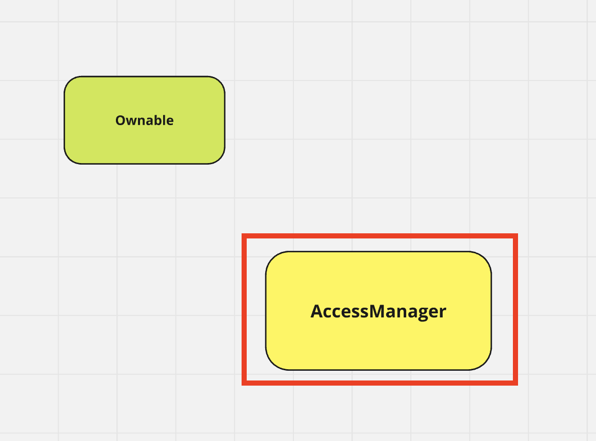
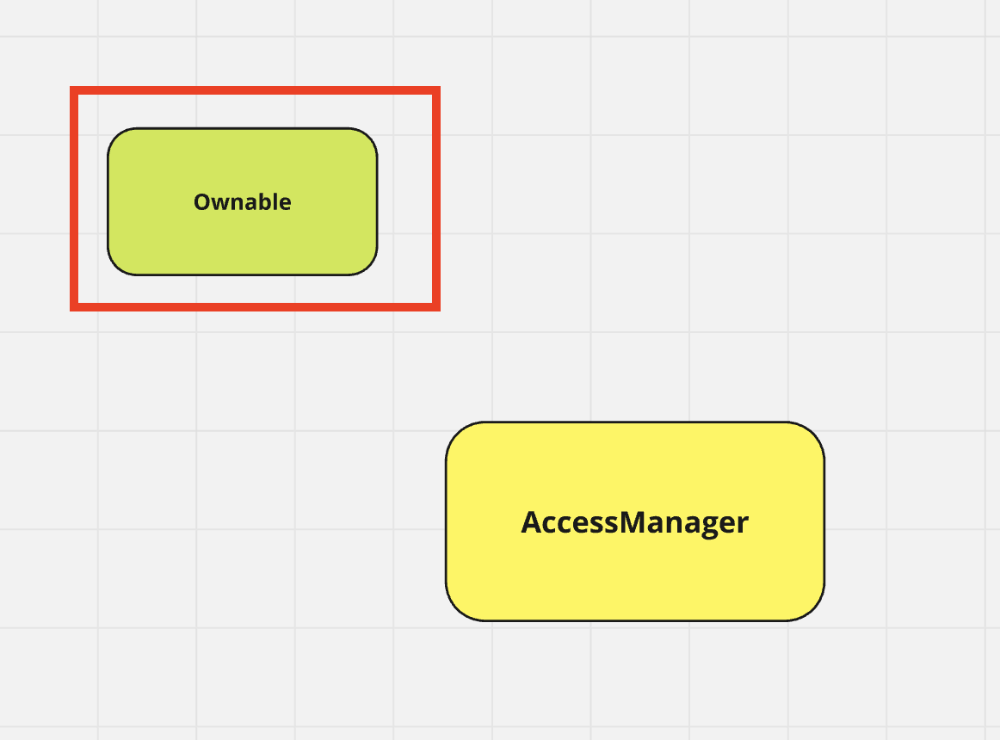
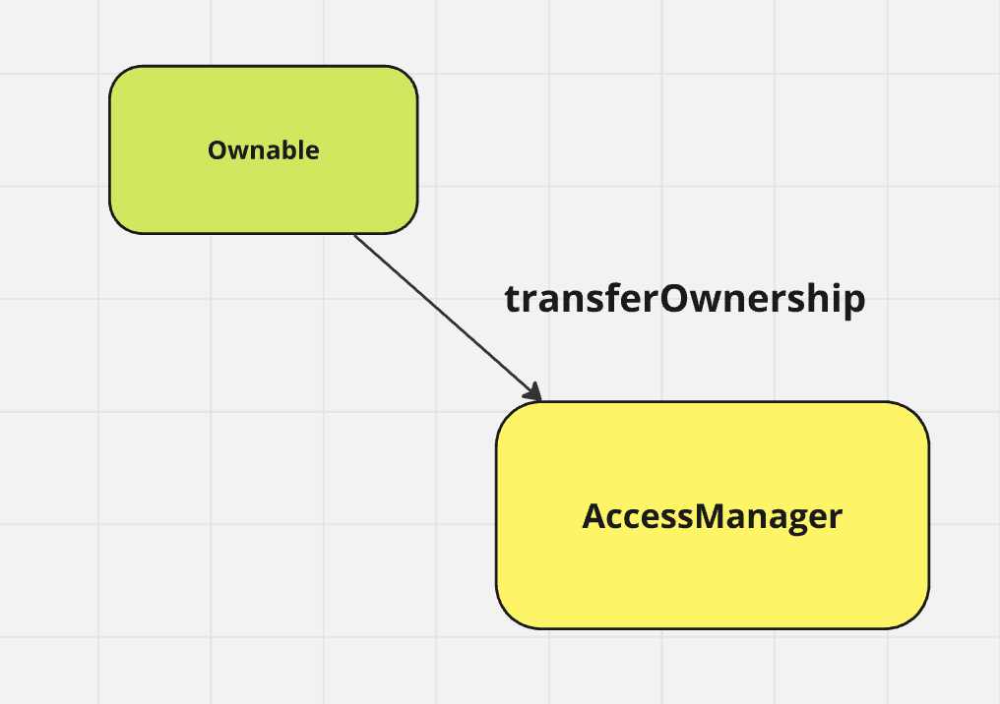
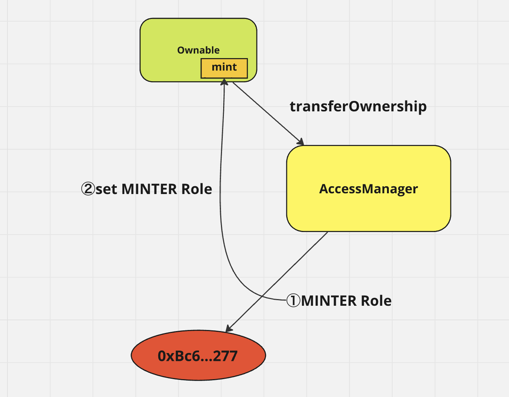
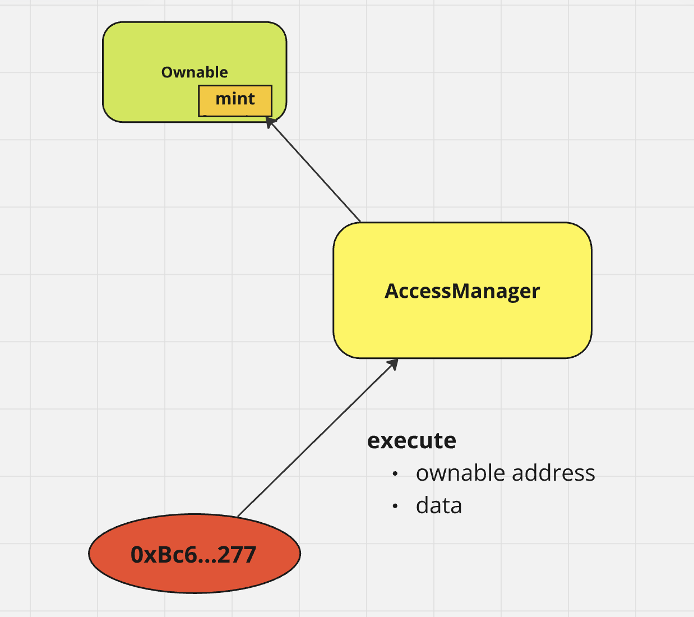

# Warning

**Please proceed with caution and take full responsibility when executing this.**
**Particularly, if you mistakenly assign the Owner role to an incorrect address using the transferOwnership function, the contract may become inoperable.**

**Make sure to thoroughly verify all details before execution and proceed at your own risk.**



## 0 Preparation

- etherscan API Key
- Infura API key(or you can use public rpc url)
- private key for test accounts
  -> don't use your real account
  - for execute
  - for minter role
- get a test token from faucet

  `https://www.alchemy.com/faucets/ethereum-sepolia`

## 1 set hardhat

### 1 install

`npm i hardaht `

### 2 create a project

`npx hardhat init <project name>`

## 2 set hardhat.config.ts

### 1 Set variables

- set etherscan API key

`npx hardhat vars set ETHERSCAN_API_KEY <your api key>`

`npx hardhat vars get ETHERSCAN_API_KEY`

- set infura API key

`npx hardhat vars set INFURA_API_KEY <your api key>`

- set sepolia private key

I strongly recommend this is test account that has no real balance

`npx hardhat vars set SEPOLIA_PRIVATE_KEY <your secret key>`

### 2 get variables

`import { vars } from "hardhat/config";`

```

const SEPOLIA_PRIVATE_KEY = vars.get("SEPOLIA_PRIVATE_KEY");
const ETHERSCAN_API_KEY = vars.get("ETHERSCAN_API_KEY");
const INFURA_API_KEY = vars.get("INFURA_API_KEY");

```

### 3 set networks

```

networks: {
sepolia: {
url: `https://sepolia.infura.io/v3/${INFURA_API_KEY}`,
accounts: [SEPOLIA_PRIVATE_KEY],
},
},

```

### 4 set etherscan

```

etherscan: {
apiKey: {
sepolia: ETHERSCAN_API_KEY,
},
},

```

## 3 Create an access manager contract



### 1 create an outline

```

contract MyAccessManager {}

```

### 2 import the accessManager

`npm i @openzeppelin/contracts`

```

import { AccessManager } from "@openzeppelin/contracts/access/manager/AccessManager.sol";

```

### 3 inherit AccessManager

### 4 constructor

```

constructor() AccessManager(msg.sender) {
}

```

## 4 Create a deploy file for access manager

### 1 create a file

`scripts/deploy/accessManager.ts`

### 2 import ethers

`import { ethers } from "hardhat";`

### 3 create a Contract Factory

`await ethers.getContractFactory`

### 4 deploy

`await ethers.deploy`
`waitForDeployment()`

## 5 deploy and verify for access manager

### 1 deploy

`npx hardhat run srcipts/deploy/accessManager.ts --network sepolia`

### 2 verify

```

npx hardhat verify --network sepolia <contract address> --contract contracts/MyAccessM
anager.sol:MyAccessManager

```

### 3 check the etherscan

`https://sepolia.etherscan.io/`

## 6 Create an onlyOwnable Contract



### 1 create an outline

```

contract ERC20Ownable {}

```

### 2 import the ERC20, Ownable

```
import { ERC20 } from "@openzeppelin/contracts/token/ERC20/ERC20.sol";
import { Ownable } from "@openzeppelin/contracts/access/Ownable.sol";
```

### 3 inherit ERC20, Ownable

### 4 constructor

`constructor() ERC20("test", "TT") Ownable(_msgSender()){}`

### 5 create a mint function with onlyOwner modifier

```

function mint(address to, uint256 amount) public onlyOwner {
\_mint(to, amount);
}

```

## 7 Create a deploy file for access managed

### 1 create a file

`scripts/deploy/erc20Ownable.ts`

### 2 import ethers

`import { ethers } from "hardhat";`

### 3 create a Contract Factory

`await ethers.getContractFactory`

### 4 deploy

`deploy()`
`waitForDeployment()`

## 8 deploy and verify for ownable

### 1 deploy

`npx hardhat run srcipts/deploy/erc20Ownable.ts --network sepolia`

### 2 verify

```
npx hardhat verify --network sepolia --contract contracts/ERC20Ownable.sol:ERC20Ownable <contract address>
```

### 3 check the etherscan

`https://sepolia.etherscan.io/`

## 9 transferOwnership



### 1 create a file

`scripts/transaction/transferOwnership.ts`

### 2 import ethers

`import { ethers } from "hardhat";`

### 3 get a Contract

`await ethers.getContractAt()`

### 4 transferOwnership

`await ownable.transferOwnership()`

### 5 execute the function

`npx hardhat run scripts/transactions/transferOwnership.ts --network sepolia`

## 10 execute a grantRole and setTargetFunctionRole function



### 1 create a file

`scripts/transaction/grantRole.ts`

### 2 import ethers

`import { ethers } from "hardhat";`

### 3 get a Contract

`await ethers.getContractAt()`

### 4 set minter role number and labelRole

`const MINTER = 42n;`

### 5 grantRole

`await manager.grantRole()`

### 6 get a mint function selector

`const mintSelector = ethers.id("mint(address,uint256)").slice(0, 10);`

### 7 setTargetFunctionRole

```
await manager.setTargetFunctionRole(
"<target address>",
[mintSelector],
MINTER
);
```

### 6 execute the grantRole and setTargetFunctionRole function

`npx hardhat run scripts/transactions/setRole.ts --network sepolia`

## 11 execute mint function



### 1 create a file

`scripts/transaction/transferOwnership.ts`

### 2 import ethers

`import { ethers } from "hardhat";`

### 3 get a Ownable Contract

`await ethers.getContractAt()`

### 4 get a testSigner

```
const testSigner = await ethers.getSigner(
<MINTER Address>
);

```

### 5 create a data

```
const data = ownable.interface.encodeFunctionData("mint", [
"<any to address>",
1000,
]);
```

### 6 execute the function

```
await manager
.connect(testSigner)
.execute("<target address>", data);
```
