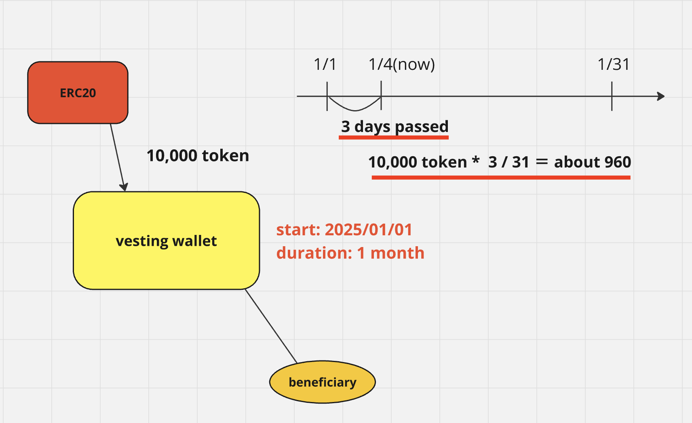
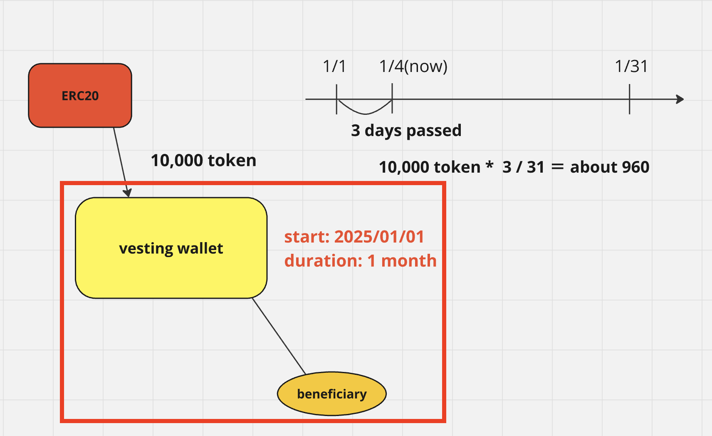
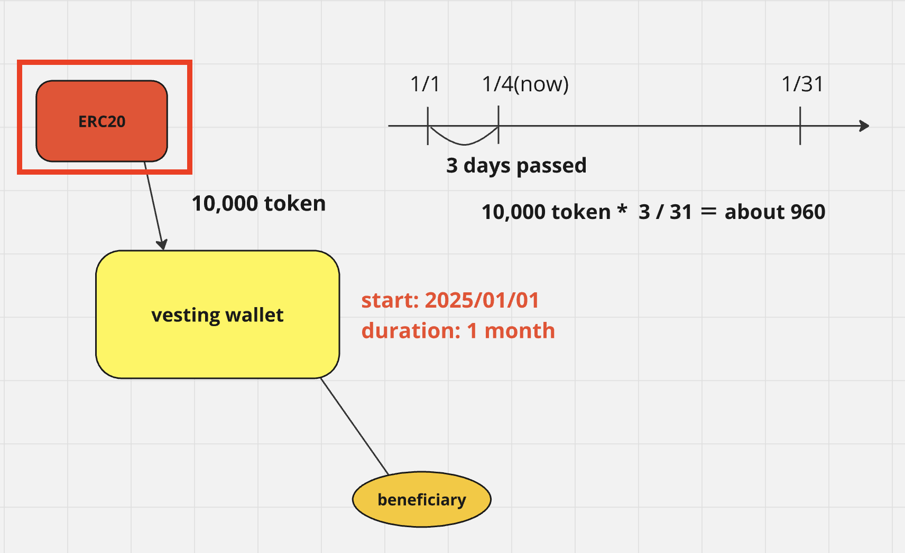
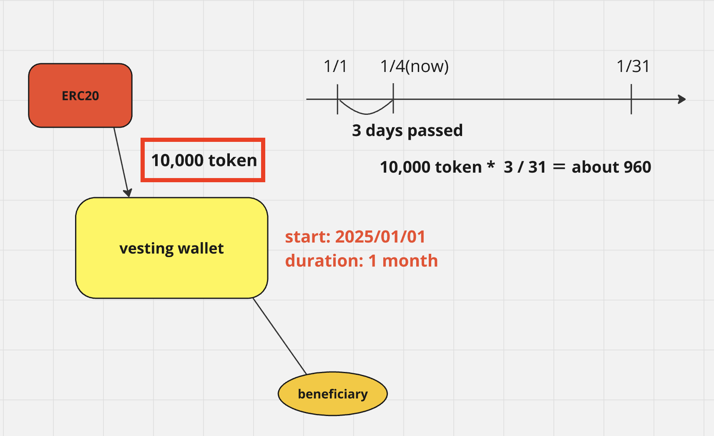
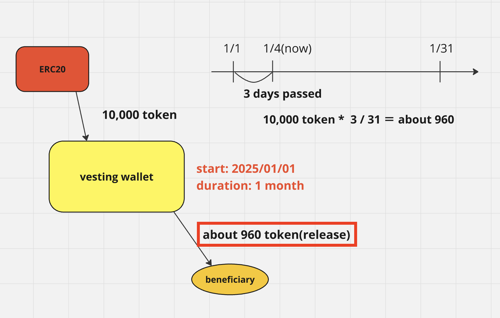

The amount of tokens that can be withdrawn increases over time.

The contract will have the following parameters: beneficiary, starttime, and duration.

The starttime can be set to a past date.

For example, if the starttime is set to January 1st and today is January 4th, three days have passed, so approximately 960 tokens can be withdrawn.

## 0 Preparation

- etherscan API Key
- Infura API key(or you can use public rpc url)
- private key for test accounts
  -> don't use your real account
  - for execute
  - for minter role
- get a test token from faucet

  `https://www.alchemy.com/faucets/ethereum-sepolia`

## 1 set hardhat

### 1 install

`npm i hardaht `

### 2 create a project

`npx hardhat init <project name>`

## 2 set hardhat.config.ts

### 1 Set variables

- set etherscan API key

`npx hardhat vars set ETHERSCAN_API_KEY <your api key>`

`npx hardhat vars get ETHERSCAN_API_KEY`

- set infura API key

`npx hardhat vars set INFURA_API_KEY <your api key>`

- set sepolia private key

I strongly recommend this is test account that has no real balance

`npx hardhat vars set SEPOLIA_PRIVATE_KEY <your secret key>`

### 2 get variables

`import { vars } from "hardhat/config";`

```

const SEPOLIA_PRIVATE_KEY = vars.get("SEPOLIA_PRIVATE_KEY");
const SEPOLIA_PRIVATE_KEY_2 = vars.get("SEPOLIA_PRIVATE_KEY_2");
const ETHERSCAN_API_KEY = vars.get("ETHERSCAN_API_KEY");
const INFURA_API_KEY = vars.get("INFURA_API_KEY");

```

### 3 set networks

```

networks: {
sepolia: {
url: `https://sepolia.infura.io/v3/${INFURA_API_KEY}`,
accounts: [SEPOLIA_PRIVATE_KEY],
},
},

```

### 4 set etherscan

```

etherscan: {
apiKey: {
sepolia: ETHERSCAN_API_KEY,
},
},

```

## 3 Create a vesting wallet contract



### 1 create an outline

```

contract CustomVestingWallet {}

```

### 2 import the accessManager

`npm i @openzeppelin/contracts`

```
import "@openzeppelin/contracts/finance/VestingWallet.sol";
```

### 3 inherit VestingWallet

### 4 constructor

```
constructor(
    address beneficiaryAddress,
    uint64 startTimestamp,
    uint64 durationSeconds
)
    VestingWallet(
        beneficiaryAddress,
        startTimestamp,
        durationSeconds
    )
{}
```

## 4 Create a deploy file

### 1 create a file

`scripts/deploy/vesting.ts`

### 2 import ethers

`import { ethers } from "hardhat";`

### 3 create a Contract Factory

`await ethers.getContractFactory`

### 4 deploy

```
const JANUARY_IN_SECONDS = 60 * 60 * 24 * 31; // 31 day(2678400)
const DAY_2025_1_1 = 1735689600;
0xBc62697F318A7A19A7167b78e1d570FF80829277
```

`await ethers.deploy`
`waitForDeployment()`

## 5 deploy and verify

### 1 deploy

`npx hardhat run srcipts/deploy/vesting.ts --network sepolia`

### 2 verify

```
npx hardhat verify --network sepolia --contract contracts/CustomVestingWallet.sol:CustomVestingWallet
<contract address>
```

### 3 check the etherscan

`https://sepolia.etherscan.io/`

## 6 Create an ERC20 Contract



### 1 create an outline

```

contract ERC20Ownable {}

```

### 2 import the ERC20, Ownable

```
import { ERC20 } from "@openzeppelin/contracts/token/ERC20/ERC20.sol";
import { Ownable } from "@openzeppelin/contracts/access/Ownable.sol";
```

### 3 inherit ERC20, Ownable

### 4 constructor

`constructor() ERC20("test", "TT") Ownable(_msgSender()){}`

### 5 create a mint function with onlyOwner modifier

```

function mint(address to, uint256 amount) public onlyOwner {
  _mint(to, amount);
}

```

## 7 Create a deploy file

### 1 create a file

`scripts/deploy/erc20Ownable.ts`

### 2 import ethers

`import { ethers } from "hardhat";`

### 3 create a Contract Factory

`await ethers.getContractFactory`

### 4 deploy

`deploy()`
`waitForDeployment()`

## 8 deploy and verify

### 1 deploy

`npx hardhat run srcipts/deploy/erc20Ownable.ts --network sepolia`

### 2 verify

```
npx hardhat verify --network sepolia --contract contracts/ERC20Ownable.sol:ERC20Ownable <contract address>
```

### 3 check the etherscan

`https://sepolia.etherscan.io/`

## 9 mint token



### 1 create a file

`scripts/transaction/mint.ts`

### 2 import ethers

`import { ethers } from "hardhat";`

### 3 get a Contract

`await ethers.getContractAt()`

### 4 transferOwnership

`await ownable.mint()`

### 5 execute the function

`npx hardhat run scripts/transactions/mint.ts --network sepolia`

## 10 release



### 1 create a file

`scripts/transaction/release.ts`

### 2 import ethers

`import { ethers } from "hardhat";`

### 3 get a Contract

`await ethers.getContractAt()`

### 4 get beneficiary address

```
const beneficiary = await ethers.getSigner(
  "0xBc62697F318A7A19A7167b78e1d570FF80829277"
);
```

### 5 release

```
await vesting["release(address)"](
  "<ERC20 address>"
);
```
