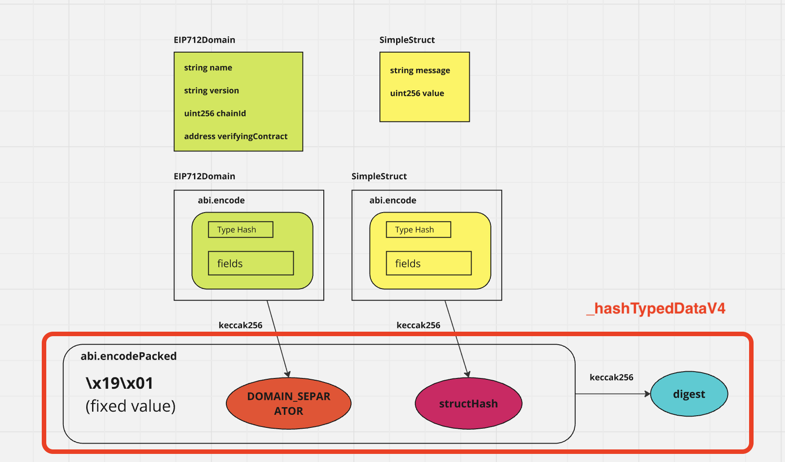
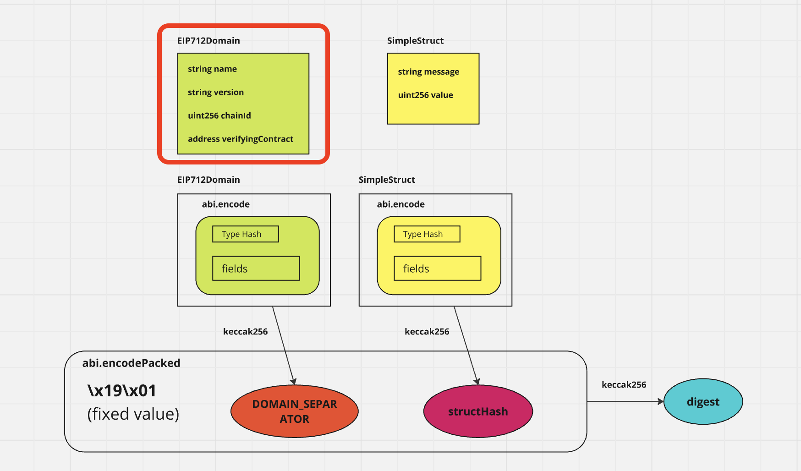
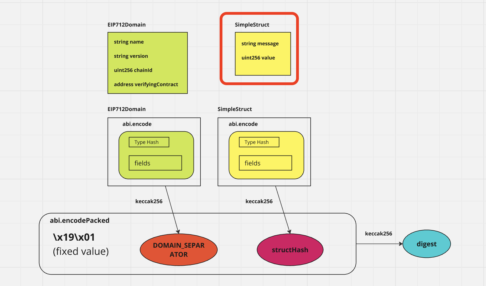

## 0 setup

### 1 install hardhat

`npm i hardhat`

### 2 create a hardhat project

`npx hardhat init <project name>`

### 3 run a local node

`npx hardhat node`

## 1 Create a verifier contract

### 1 create an outline

`contract ERC712Verifier {}`

### 2 import ECDSA and EIP712

`npm i @openzeppelin/contracts`

`import "@openzeppelin/contracts/utils/cryptography/ECDSA.sol";`
`import "@openzeppelin/contracts/utils/cryptography/EIP712.sol";`

### 3 inherit EIP712

### 4 create a constructor to set domain selector


`constructor() EIP712("SimpleEIP712Example", "1") {}`

### 5 set ECDSA to bytes32(to use recover function)

`using ECDSA for bytes32;`

### 6 create type hashes

```
struct SimpleStruct {
    string message;
    uint256 value;
}
```


```
bytes32 private constant MESSAGE_TYPEHASH = keccak256(
    "SimpleStruct(string message,uint256 value)"
);
```

### 7 create a verify function

#### 1 create an outline

`function verify() public view returns(bool) {}`

### 2 set arguments

```
address signer,
SimpleStruct calldata request,
bytes calldata signature
```

#### 3 create a structHash


```
bytes32 structHash = keccak256(abi.encode(
        MESSAGE_TYPEHASH,
        keccak256(bytes(request.message)),
        request.value
));
```

#### 4 create a digest



```
bytes32 digest =  _hashTypedDataV4(structHash);
```

#### 5 return the result

`return digest.recover(signature) == signer;`

## 2 deploy

### 1 create a deploy file

`scripts/deploy/eip712.ts`

### 2 import ethers

`import { ethers } from "hardhat";`

### 3 create an async function

```
async function main(){}

main().catch((error) => { console.error(error)});
```

### 4 get a contract factory

`await ethers.getContractFactory("name")`

### 5 deploy

`await Verifier.deploy()`

### 6 run the file

`npx hardhat run scripts/deploy/verify.ts --network localhost`

## 3 verify

### 1 create a file

`scripts/transactions/verify.ts`

### 2 import ethers and create async function

```
import { ethers } from "hardhat";

async function main() {}

main().catch((error) => {
  console.error(error);
});
```

### 3 create provider and signer

```
const provider = ethers.provider;

const signer = (await ethers.getSigners())[0];
```

### 4 get the contract

```
const verifier = await ethers.getContractAt(
    "SimpleEIP712Example",
    <contract address>
);
```

### 5 create a domain



```
const domain = {
    name: "SimpleEIP712Example",
    version: "1",
    chainId: (await provider.getNetwork()).chainId,
    verifyingContract: "0x5FbDB2315678afecb367f032d93F642f64180aa3",
};

```

### 6 create a types



```
const types = {
    SimpleStruct: [
      { name: "message", type: "string" },
      { name: "value", type: "uint256" },
    ],
  };
```

### 7 create a message

```
const message = {
    message: "Hello, EIP-712!",
    value: 42,
  };
```

### 8 create a signature

`const signature = await signer.signTypedData(domain, types, message);`

### 9 verify the signature

```
const result = await verifier.verify(signer.address, message, signature);
```
